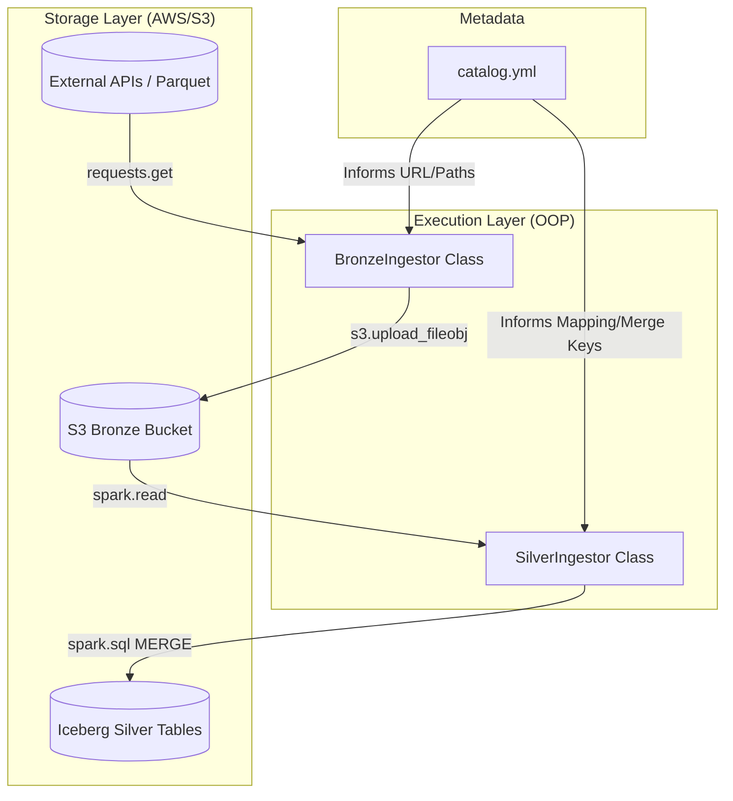

# Architecture Decision Record (ADR)

## 📝 ADR 0003: Metadata-Driven Ingestion using OOP

**Status:** Accepted  
**Date:** 2026-01-12  

---

### 1. Context
Previously, ingestion and transformation logic were handled by individual, procedural scripts (e.g., `bronze_ingestion_taxi.py`). As the project expanded to include multiple sources (Yellow Taxi, Uber, Zone Lookups), this procedural approach led to:

* **Code Duplication:** Logging, error handling, and S3 connections were rewritten in every file.
* **Rigid Logic:** Adding a new data source required creating a new Python file.
* **Maintenance Overhead:** Changes in the observability layer (logging/notifying) required manual updates in multiple scripts.

### 2. Decision
I have implemented a **Metadata-Driven OOP Architecture** by creating specialized classes: `BronzeIngestor` and `SilverIngestor`. 

This design pattern separates the **Execution Engine** (the Python Class) from the **Business Logic** (the `catalog.yml` metadata).

---

### 3. Rationale (Why this code works)

| Principle | Benefit |
| :--- | :--- |
| **Inheritance-ready Design** | By using classes, I can create a `BaseIngestor` to share methods like `_load_catalog()` across both layers, adhering to the **DRY (Don't Repeat Yourself)** principle. |
| **State Management** | The `__init__` method handles the lifecycle of Spark Sessions and S3 Clients, ensuring resources are initialized once per execution. |
| **Abstraction of Complexity** | The `.run()` method provides a clean interface for orchestrators (Airflow/Makefile). The orchestrator only calls the method without needing to know internal Spark or Boto3 logic. |
| **Idempotency & Resilience** | **Bronze:** Direct stream uploads to S3.   **Silver:** Uses Iceberg `MERGE` (UPSERT) logic. Metadata-defined `merge_keys` prevent duplicate records on re-runs. |
| **Dynamic Transformation** | Using list comprehensions to map source columns to targets allows schema changes via YAML, without modifying Python code. |

---

### 4. Consequences

#### ✅ Positive
* **Scalability:** Adding a new data source is now a "Configuration-only" task.
* **Centralized Troubleshooting:** Logic fixes for the Silver layer (like a `MERGE` bug) are handled in one place and apply to all sources.

#### ⚠️ Negative
* **Technical Debt/Complexity:** Requires developers to have a deeper understanding of Python Classes, Spark TempViews, and YAML parsing.

---

### 5. Architectural View (Mermaid)
This Mermaid Diagram illustrate the ingestion flow:

